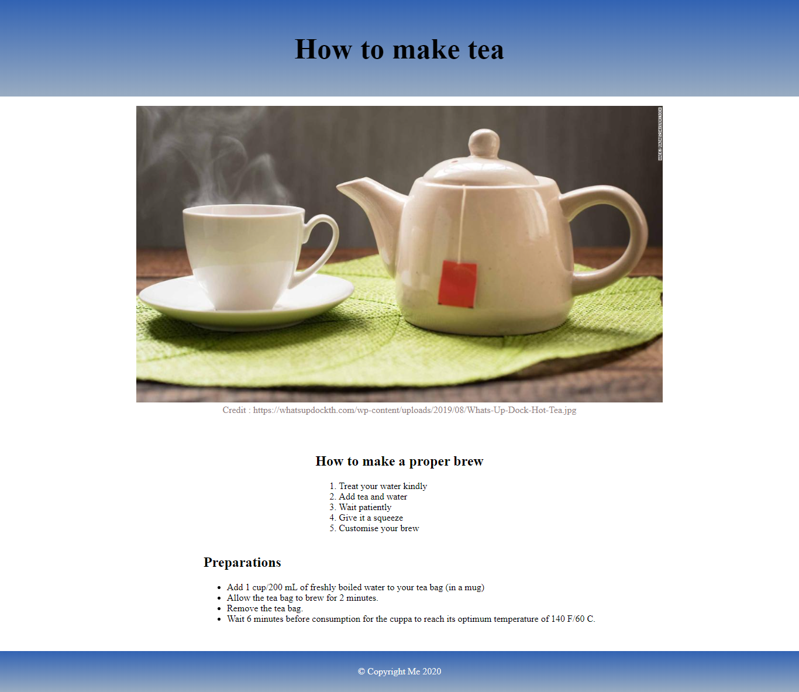
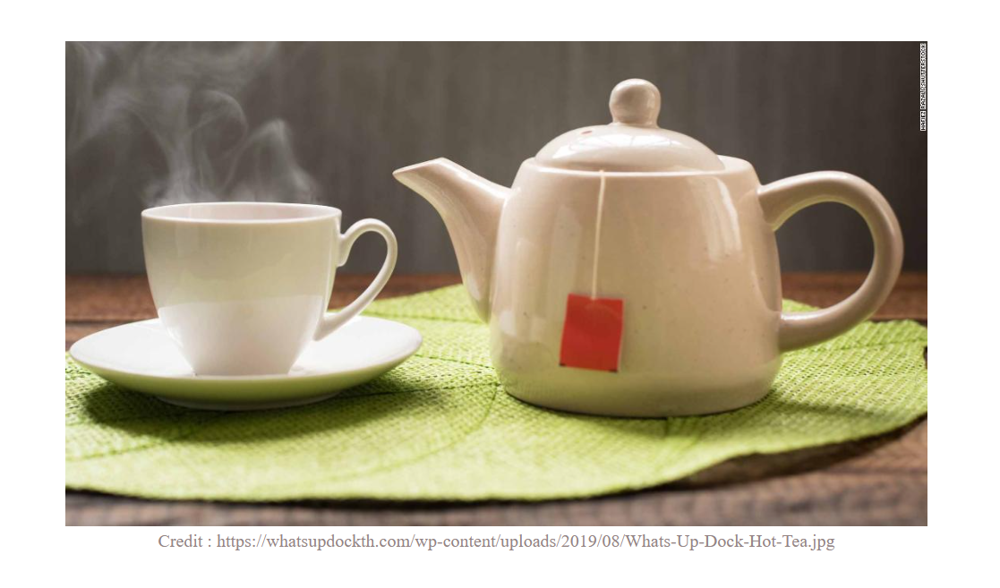

<div align="center">
    <h1>How to make tea workshop</h1>
</div>

สิ่งที่ได้เรียนรู้จากการลงมือทำ workshop นี้คือ

1. [html](#html)
2. [css](#css)

ภาพตัวอย่างของ workshop นี้


## HTML

สำหรับการวางโครงสร้างของ html นั้น จะแบ่งออกทั้งหมดเป็น 3 ส่วนด้วยกัน ได้แก่

1. header
2. container (เอาไว้เก็บ centent ต่างๆ)
3. Footer

### header

```html
<header class="header">
  <h1>How to make tea</h1>
</header>
```

### container

```html
<div class="container">
  <section class="picture">
    <figure>
      
      <figcaption class="figcaptionShow">
        Credit :
        https://whatsupdockth.com/wp-content/uploads/2019/08/Whats-Up-Dock-Hot-Tea.jpg
      </figcaption>
    </figure>
  </section>

  <section>
    <h2>How to make a proper brew</h2>
    <ol>
      <li>Treat your water kindly</li>
      <li>Add tea and water</li>
      <li>Wait patiently</li>
      <li>Give it a squeeze</li>
      <li>Customise your brew</li>
    </ol>
  </section>

  <section>
    <h2>Preparations</h2>
    <ul>
      <li>
        Add 1 cup/200 mL of freshly boiled water to your tea bag (in a mug)
      </li>
      <li>Allow the tea bag to brew for 2 minutes.</li>
      <li>Remove the tea bag.</li>
      <li>
        Wait 6 minutes before consumption for the cuppa to reach its optimum
        temperature of 140 F/60 C.
      </li>
    </ul>
  </section>
</div>
```



```html
<figure>
  
  <figcaption>
    Credit :
    https://whatsupdockth.com/wp-content/uploads/2019/08/Whats-Up-Dock-Hot-Tea.jpg
  </figcaption>
</figure>
```

### footer

```html
<footer class="footer">
  <p>&copy Copyright Me 2020</p>
</footer>
```


> จากตัวอย่าง Code ที่เห็น จะพบว่า เราวางโครงสร้างเพียงแค่ 3 ส่วนเท่านั้น คือ
>
> 1. header
> 2. container
> 3. footer
>    แต่สิ่งที่ทำให้ website ของเราสวยงามมากยิ่งขึ้นคือ css นั้นเอง

## CSS

<!-- box-sizing: border-box; ถ้าหากเรากำหนดตัวนี้ลงไป เราจะได้ขนาดของ Box ที่มีขนาดเท่ากับความเป็นจริงโดยที่เราไม่ต้องไปคำนวณเอง  -->

สำหรับ css นั้น ในตอนเริ่มต้นเรา จะต้องทำการ setting ค่าต่างให้เป็นแบบนี้

```css
body {
  padding: 0;
  margin: 0;
  box-sizing: border-box;
}
```

- padding: 0; เราตั้งค่าให้เป็น 0 เพื่อที่จะเคลียร์ค่า default ของ brownser

- margin: 0; เราตั้งค่าให้เป็น 0 เพื่อที่จะเคลียร์ค่า default ของ brownser

ิ- box-sizing: border-box; การใช้ box-sizing: border-box นั้นใช้สำหรับเมื่อเราต้องการกำหนดขนาดของ element นั้นตามค่า width เลยโดยไม่นำ padding และ border มาคิดภายนอก ยกเว้น margin ที่จะคิดภายนอก element เช่นเดิม

- background: linear-gradient(rgb(50, 99, 179), rgb(153, 172, 194)); เป็นการตั้งค่า background ให้เป็นแบบ linear

```css
/* กรณีที่เราต้องการให้การแสดงผลมีค่าแบบ Responsive ตามขนาดที่เราต้องการ */
@media (max-width: 700px) {
  .header {
    font-size: 15px;
  }
}
```
